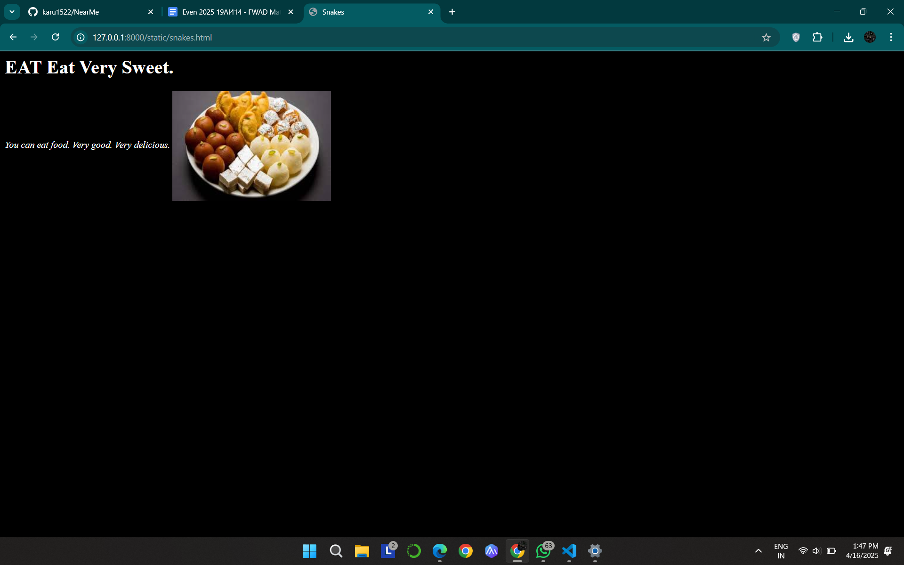
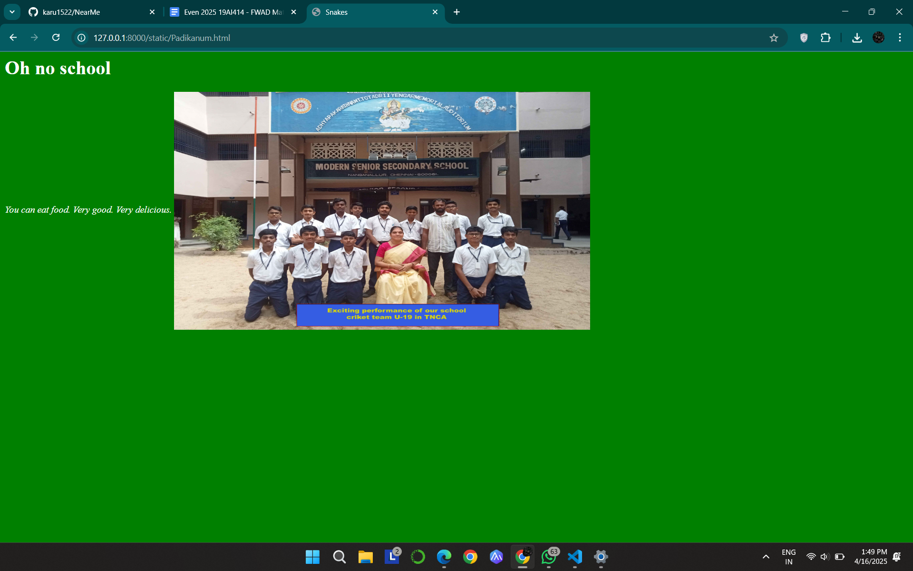
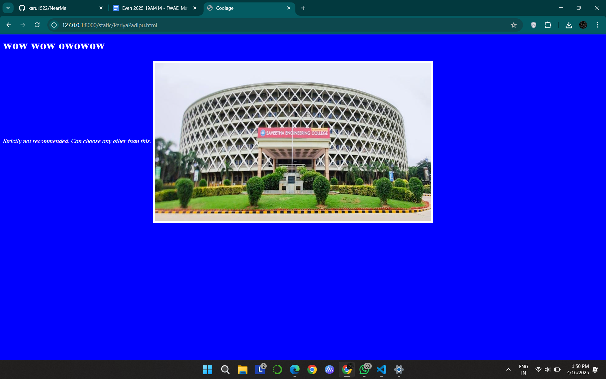

# Ex04 Places Around Me
## Date: 16-04-2025

## AIM
To develop a website to display details about the places around my house.

## DESIGN STEPS

### STEP 1
Create a Django admin interface.

### STEP 2
Download your city map from Google.

### STEP 3
Using ```<map>``` tag name the map.

### STEP 4
Create clickable regions in the image using ```<area>``` tag.

### STEP 5
Write HTML programs for all the regions identified.

### STEP 6
Execute the programs and publish them.

## CODE
```
home.html
<!DOCTYPE html>
<html>
    <head>
        <title>Location</title>
    </head>
    <body>
        <!-- Image Map Generated by http://www.image-map.net/ -->


<map name="image-map">
    <area target="" alt="Sapudu" title="Sapudu" href="snakes.html" coords="883,511,946,566" shape="rect">
    <area target="" alt="Parama Padi da" title="Parama Padi da" href="Padikanum.html" coords="595,907,76" shape="circle">
    <area target="" alt="Pathukalam" title="Pathukalam" href="PeriyaPadipu.html" coords="1749,576,1840,572,1903,637,1869,689,1767,689,1712,643,1691,579" shape="poly">
</map>
    </body>
</html>
snakes.html
<html>
    <head><h1>EAT Eat Very Sweet.</h1></head>
    <title>Snakes</title>
    <body text="white" bgcolor="black">
        <i>You can eat food. Very good. Very delicious.</i>
        
    </body>
</html>
Padikanum.html
<html>
    <head><h1>Oh no school</h1></head>
    <title>Snakes</title>
    <body text="white" bgcolor="green">
        <i>Not recommended for students above 18.</i>
        
    </body>
</html>
PeriyaPadipu.html
<html>
    <head><h1>wow wow owowow</h1></head>
    <title>Coolage</title>
    <body text="white" bgcolor="blue">
        <i>Strictly not recommended. Can choose any other than this.</i>
        
    </body>
</html>
```

## OUTPUT








## RESULT
The program for implementing image maps using HTML is executed successfully.
